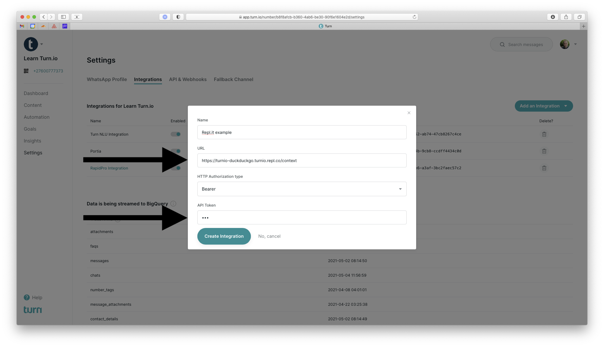

# turnio-duckduckgo-replit

An example Turn.io suggested reply integration on Replit. This will return the abstract from the DuckDuckGo API as a suggested reply in the Turn.io UI

## How to run this Repl.it example

Click the Run on Repl.it button below to install this code example into your Repl.it workspace. Repl.it creates a free workspace for you to do this in. If you don't have an account yet, you can create one in the process at no cost or further commitments.

When it has completed installing the code into your workspace, click the `Run` button at the top of the Repl.it browser window.

This will start the application on a URL provided by Repl.it. In the screenshot you will notice that it is https://turnio-duckduckgo.turnio.repl.co/ but it will be different for your own workspace.

Please take note that the default example expects Turn to communicate with the integration at the `/context` path.

Now log-in to your account on Turn. For most this will be at https://app.turn.io. If you're on a private cloud setup then please reach out to Turn.io Support via WhatsApp if you're unsure about the address of your Turn installation.

Go to the `Settings` section.

Then click on the `Integrations` tab and select `Custom Integration` from the `Add an Integration` drop down menu.

Provide the URL generated by `Repl.it` and append the `/context` path to it. At the moment Turn requires one to supply an authentication header. For this example we are not requiring that in the backend, feel free to type `123` or anything else in the API Token field.

Click on the `Create Integration` button. 

Now whenever you open a chat in Turn, it will request a best reply from [DuckDuckGo](https://duckduckgo.com) and display that in the Turn user interface as a best reply response to an incoming message.

